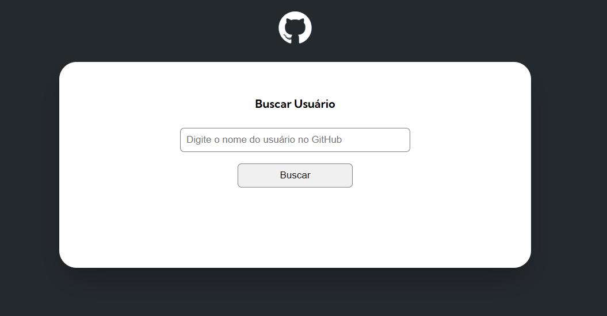
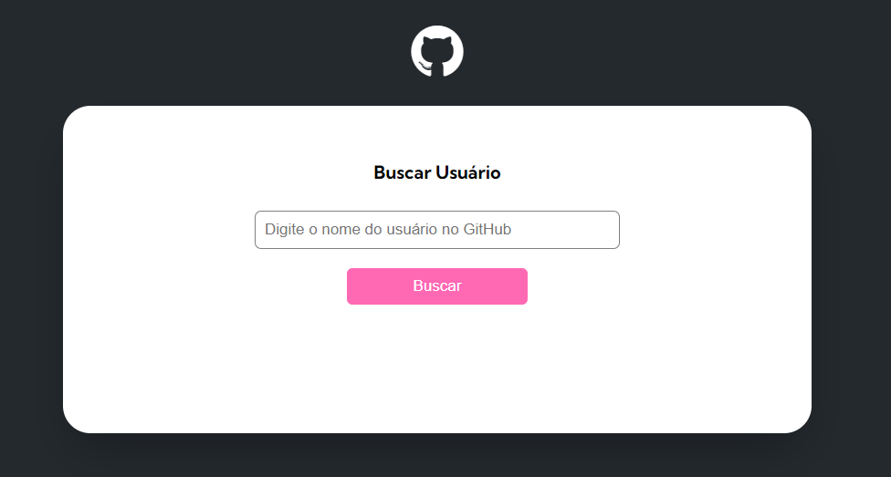

# projeto-inicial-fetch-github-api
Repositório contendo os arquivos iniciais do projeto de Fetch e GitHub API

Um projeto de HTML, CSS3 e JavaScript, com o intuito de demonstrar meus conhecimentos adquiridos até o momento no @Devemdobro com o curso DevQuest de formação Fullstack com mentoria, criando uma interação com a API do GitHub. 🚀

## Tecnologias utilizadas

- HTML
- CSS
- JavaScript

---

### Coisas que **aprendi**:

1. interagir com a API.
2. Fragmentar o código de uma maneira que ele fiquei fluido e com melhor velocidade de renderiação.

---

### **Dificuldades** enfrentadas

- entender quando dividir o código e trabalhar com o import.

---

### Autor

- Execução do projeto - [Igor Batista](https://github.com/igor-batista-pereira)